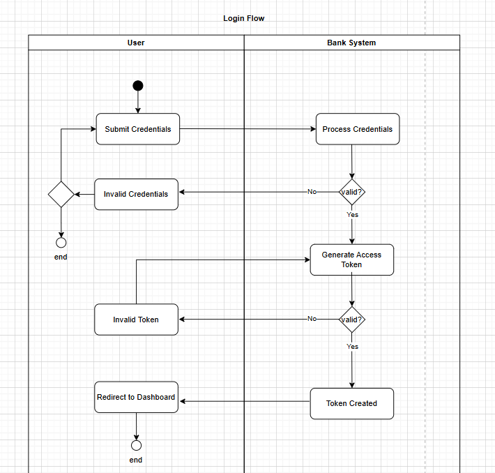

<!--  -->

# UML Activity Diagram (RevoBank)
## Purpose of Each Diagram

1. The Login activity diagram visualize the flow of the login process.
- Begin the Login process   
   - User submitting login credentials
   - Bank System processing the credentials 
     - Valid : (Check username & password)
        - System generate access token and check the token
            - Valid token = Token created
                - Redirect to Dashboard
            - Invalid token = auto generate access token
     - Invalid credentials
        - Option to resubmit credentials
        - Option to exit

2. The Transaction diagram visualize the flow of the transaction (internal/external) process.
- Begin the Transaction process   
   - User submitting transaction details
   - Bank system validate the balance of the user
     - Valid : (Check Balance)
        - Deduct Balance of the user
            - Generate transaction ID
                - Option to Internal or External Payment
                  - Internal
                    - Directly update the transaction history in the database
                  - External
                    - RevoBank system send request transaction to Payment Gateway
                    - Payment will check everything and process transaction, if valid:
                        - valid: directly update to the bank system database
                        - invalid: bank system will check the payment status, if failed then update to database
     - Invalid balance
        - Confirmation message to user "Insufficient Balance" and end the process

## Key decisions and Processes Represented 
1. Login 
    - Decision : #### is the username & password Valid?
        -   Yes = System generate token and check the token (decision), token created and redirect to dashboard
        - No = Display confirmation to user "Invalid Credentials" 
    - Process :
        - If valid credentials, the system generate token and check and automatically check the token if expired, 
            - if token not expired, token created and redirect to dashboard
            - if expired, regenerate the token
        - If invalid credentials, will display confirmation message and and the process

Notes for improvement: System should records for the failed attempt, failed attempt 3x(send email notif)& should end the process

2. Transaction Handling
    - Decision : ####is the Balance of the User is sufficient?
        -   Yes : Deduct the Balance and Generate transaction ID,after this system checking again if the payment external (decision), if internal directly updating the database and display transaction success
        -   No : Display confirmation message "Insufficient Balance" and end the process
    - Process :
        - If sufficient: System will deduct the balance & Generate transaction ID, and internal payment will directly updating database and display confirmation success and end process
        - If insufficient : System automatically sends confirmation insufficient and end the process

    - Decision : #### is the Payment is External or Not?
        -   Yes : After checking balance, the system sends transaction request to Payment Gateway and the Transaction will be processed, the payment gateway will check all validity(decision) and give the status back to the RevoBank system.
        -   No : The system directly updating the transaction history to the database and shows confirmation to the user 

    - Process :
        - If External, The Transaction will be processed in the payment gateway after got requests from RevoBank system, 
            - if all data Valid= directly updating the database in bank system, 
            - if data invalid= Status will be checked in Bank system and the database will be updated
        - If Internal, system directly update the transaction history to the database and confirmation will be display to user and end the process

Notes for improvement:
More detail Flow 
- detail submit transaction before checking in bank system
- check the account first if exist?
    - if yes input the amount 
    - if no receive error message and reselect payment account
- system ask & user enter amount, click next, the system check the balance, 
    - if sufficient confirm payment and enter pin  
        - after enter pin check first the pin isValid?
            - if yes process the payment
            - if no send error and receive error -> retry enter pin
    - if insufficient record payment failed+send error message--> back to home action - and end the process
- process payment action, decision isSuccess?
    - if yes put fork of send success notifs+update transaction records, payment success in user swimlane, end process
    - if failed , send failed notif, user can try retry the payment process

## UML Activity Diagrams
#### The UML activity diagrams were created using draw.io

<!-- ### Registration 
 -->

### Login 

### Transaction Handling 

